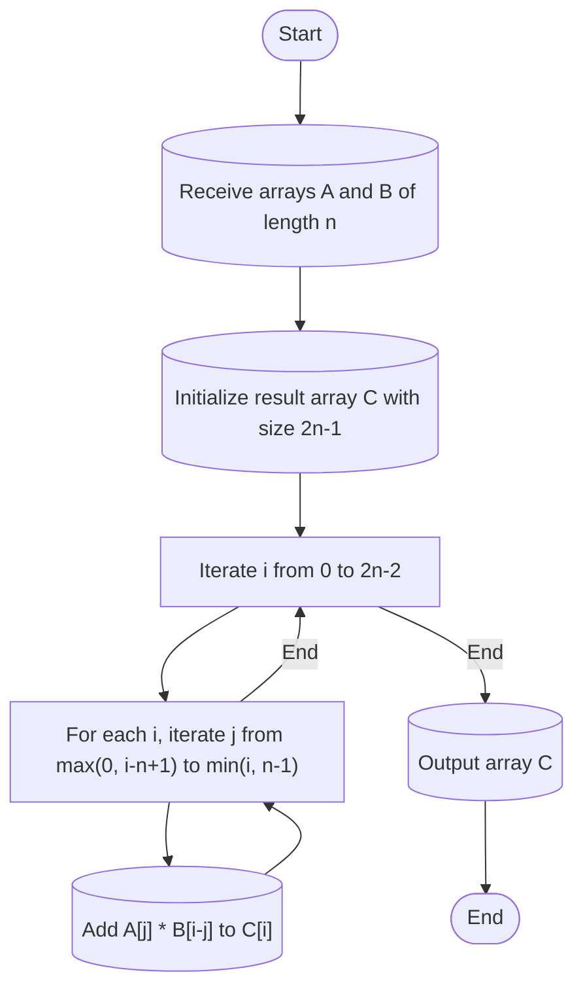

### Please gain inspiration from Program Problem and Solution to create a high-quality **Mermaid Diagram code** to describe the code in Problem or Solution. 

#### Problem for inspiration:
{problem}

#### Solution:
{solution}

#### Guidelines for creating mermaid diagram code:
1. Identify and highlight the key information from the problem and solution to include in the Mermaid diagram, such as main processes, detail args, steps, decision points, and outcomes.
2. Use Mermaid syntax to visually represent the flow of the problem and solution. For example, you can use **flowcharts, sequence diagrams, or class diagrams .etc** depending on the complexity and nature of the problem and solution.
3. Place the Mermaid code inside ```mermaid ```.
4. Description in diagram should be natural, here is a example:

5. Most Importantly, **ensuring all text is described within quotes** to avoid syntax errors.
